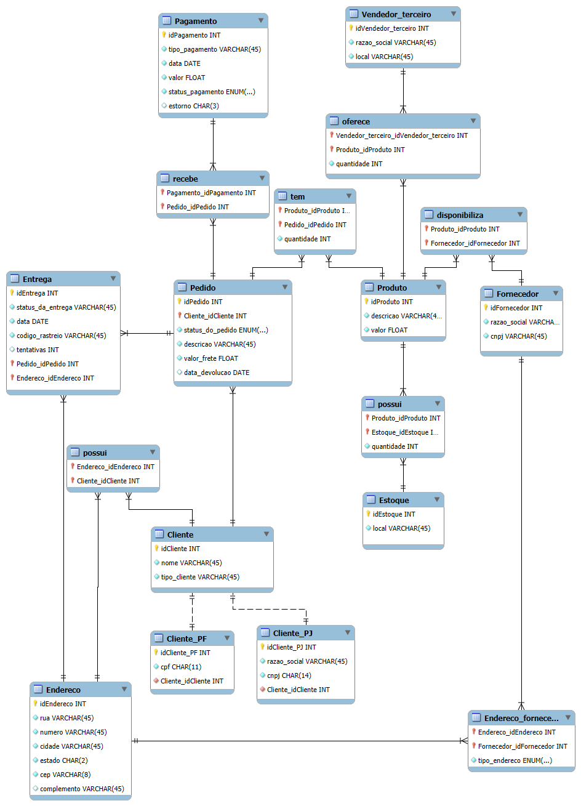

# 📦 E-commerce - Modelagem de Banco de Dados (DER)

Este repositório contém o Diagrama de Entidade-Relacionamento (DER) de um sistema de e-commerce, projetado para garantir eficiência, escalabilidade e consistência dos dados.

## 📌 Visão Geral do Modelo

O modelo foi desenvolvido para atender às principais operações de um e-commerce, incluindo:

- Cadastro de clientes, diferenciando Pessoa Física (CPF) e Pessoa Jurídica (CNPJ);
- Gerenciamento de pedidos, permitindo múltiplos produtos e diferentes formas de pagamento;
- Controle de entregas, com status e código de rastreamento;
- Relacionamento entre clientes e endereços, possibilitando múltiplos endereços cadastrados;
- Gestão de devoluções de pedidos, via campo `data_devolucao`;
- Gerenciamento eficiente de estoque;
- Relacionamento entre fornecedores e seus endereços.

## 📊 Diagrama de Entidade-Relacionamento (DER)

## 📍 Entidades e Regras de Negócio

### 1️⃣ Cliente

#### 📌 Regras de Negócio:

- Cada cliente pode se cadastrar como Pessoa Física (PF) ou Pessoa Jurídica (PJ), definido na tabela `Cliente`.
- Os dados específicos de CPF e CNPJ são armazenados em tabelas separadas (`Cliente_PF` e `Cliente_PJ`).
- Cada cliente pode ter múltiplos endereços cadastrados.
- Um cliente pode realizar múltiplos pedidos ao longo do tempo.

#### 📌 Relacionamentos:

- **1:N** → `Pedido`: Um cliente pode ter vários pedidos.
- **1:N** → `Endereco` (via tabela "possui"): Um cliente pode cadastrar múltiplos endereços.
- **1:1** → `Cliente_PF`: Se o cliente for PF, ele terá um registro correspondente na tabela `Cliente_PF`.
- **1:1** → `Cliente_PJ`: Se o cliente for PJ, ele terá um registro correspondente na tabela `Cliente_PJ`.

#### 📌 Motivo para Separação de `Cliente_PF` e `Cliente_PJ`:

- Evita redundância, pois um cliente nunca terá CPF e CNPJ ao mesmo tempo.
- Melhora a performance, permitindo consultas otimizadas apenas na tabela necessária.

### 2️⃣ Cliente_PF e Cliente_PJ

#### 📌 Regras de Negócio:

- A tabela `Cliente_PF` armazena o CPF de clientes pessoa física.
- A tabela `Cliente_PJ` armazena o CNPJ e a Razão Social de clientes pessoa jurídica.

#### 📌 Relacionamentos:

- **1:1** → `Cliente`: Cada cliente terá no máximo um registro em `Cliente_PF` ou `Cliente_PJ`.

#### 📌 Vantagens do Relacionamento 1:1:

- ✅ Garante que um cliente pode ser apenas PF ou PJ, nunca os dois ao mesmo tempo.
- ✅ Evita desperdício de espaço com campos `NULL` desnecessários.

### 3️⃣ Endereco

#### 📌 Regras de Negócio:

- Cada cliente pode cadastrar múltiplos endereços (exemplo: casa, trabalho).
- O mesmo endereço pode ser reutilizado para várias entregas.

#### 📌 Relacionamentos:

- **1:N** → `Cliente` (via "possui"): Um cliente pode ter vários endereços cadastrados.
- **1:N** → `Entrega`: Cada entrega está vinculada a um único endereço.

#### 📌 Vantagens do Relacionamento:

- ✅ Evita redundância, pois um endereço pode ser reutilizado.
- ✅ Facilita cálculos de frete ao vincular o endereço ao pedido.

### 4️⃣ Pedido

#### 📌 Regras de Negócio:

- Cada pedido é criado por um cliente e pode conter um ou mais produtos.
- O pedido pode ser pago de várias formas.
- O campo `data_devolucao` permite rastrear devoluções de produtos.

#### 📌 Relacionamentos:

- **1:N** → `Cliente`: Um cliente pode ter múltiplos pedidos.
- **N:M** → `Produto` (via tabela "tem"): Um pedido pode conter vários produtos e vice-versa.
- **1:N** → `Entrega`: Cada pedido pode ter uma ou mais entregas.
- **N:M** → `Pagamento` (via tabela "recebe"): Um pedido pode ser pago de diferentes formas.

#### 📌 Vantagens do Relacionamento:

- ✅ Permite pagamentos flexíveis (exemplo: cartão + boleto).
- ✅ Facilita rastreamento de devoluções com `data_devolucao`.

### 5️⃣ Pagamento

#### 📌 Regras de Negócio:

- Um pedido pode ser pago de várias formas.
- Agora há um campo `status_pagamento` para indicar se o pagamento está pendente, aprovado ou cancelado.
- O campo `estorno` indica se o pagamento foi reembolsado.

#### 📌 Relacionamentos:

- **N:M** → `Pedido` (via "recebe"): Um pedido pode ter múltiplos pagamentos.

#### 📌 Vantagens do Relacionamento:

- ✅ Permite diferentes formas de pagamento (exemplo: cartão + PIX).
- ✅ Facilita gestão de transações financeiras e reembolsos.

### 6️⃣ Produto

#### 📌 Regras de Negócio:

- Cada produto possui um fornecedor.
- O mesmo produto pode ser vendido por diferentes vendedores terceiros.
- O estoque é gerenciado separadamente.

#### 📌 Relacionamentos:

- **N:1** → `Fornecedor` (via "disponibiliza"): Cada produto tem um fornecedor.
- **N:M** → `Pedido` (via "tem"): Produtos podem estar em vários pedidos.
- **N:M** → `Vendedor_Terceiro` (via "oferece"): Produtos podem ser vendidos por múltiplos vendedores.
- **N:M** → `Estoque` (via "possui"): O mesmo produto pode estar em diferentes locais de estoque.

### 7️⃣ Fornecedor

#### 📌 Regras de Negócio:

- Um fornecedor pode fornecer vários produtos.
- Agora há uma tabela intermediária `Endereco_fornecedor` para armazenar múltiplos endereços.

#### 📌 Relacionamentos:

- **1:N** → `Produto` (via "disponibiliza"): Cada produto tem um fornecedor.
- **1:N** → `Endereco_fornecedor`: Cada fornecedor pode ter múltiplos endereços.

#### 📌 Vantagens do Relacionamento:

- ✅ Facilita gestão de fornecedores com múltiplos endereços.
- ✅ Melhora rastreamento da origem dos produtos.

## 🚀 Conclusão

Este modelo de banco de dados para e-commerce foi projetado para maximizar a eficiência, reduzir redundância e garantir escalabilidade.

### 🔹 Principais Melhorias:

- ✅ Criação das tabelas `Cliente_PF` e `Cliente_PJ`, removendo redundância de CPF e CNPJ.
- ✅ Novo campo `status_pagamento` e `estorno` para melhor controle de pagamentos e reembolsos.
- ✅ Modelo flexível para diferentes formas de pagamento e múltiplas entregas.
- ✅ Gestão eficiente de fornecedores e produtos.
